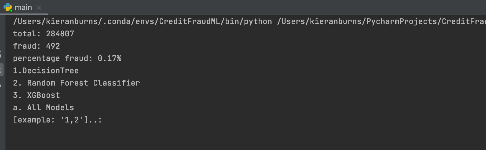
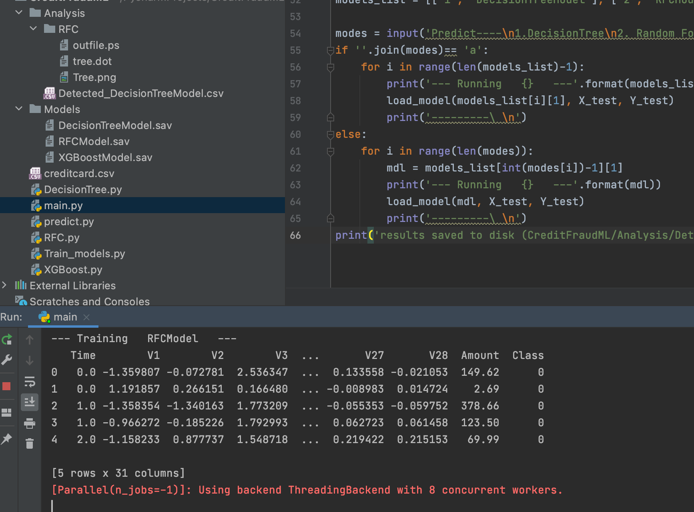
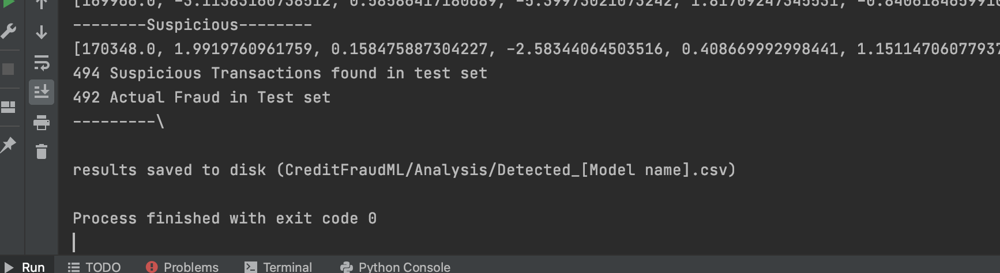
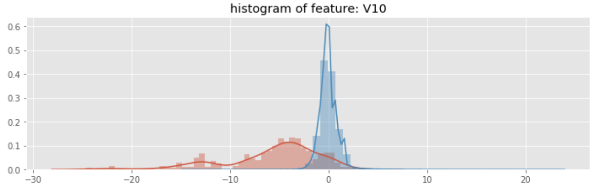
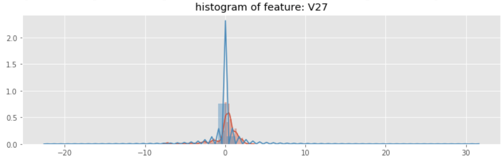
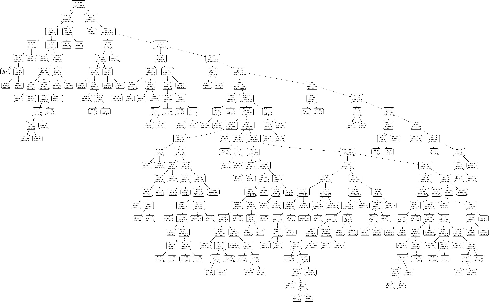

# CreditFraudML-Project
### By Kieran Burns

This is a machine learning project developed in python to detect fraudulent credit card transactions.
It makes use of these models from the scikit library:
* XGBoost
* Decision Trees
* Random Forest Classifier

The dataset used is available here https://www.kaggle.com/mlg-ulb/creditcardfraud and contains anonymised data from two days, where there are 492 fraudulent transactions out of 284,807. The dataset is highly unbalanced, the frauds account for just 0.172% of all transactions.

The program main.py will ask the user which models they want to train. The program will call the subprogram for training each model on a random selection of the dataset. Each trained model is saved to disk in a .sav file so that new predictions can be made without having to retrain each one. They will then have the option to make predictions on the dataset for each. The transactions that the program classes as suspicious are saved to a csv file for later reference.

## Challenges
The data used is highly unbalanced which makes training more difficult. This can be overcome by oversampling the fraudulent transactions.
Furthermore, columns V1 to V28 have gone through a PCA transformation to reduce their dimensionality in order to make it confidential. This has made visualisation of the data necessary to understand the correlation between fraudulent and non-fraudulent cases. Graphs of the features were created using the matplotlib library for python to show the difference for each.

## Evaluation

The program also gives the user the option to create a graph of the tree when building the Random Forest Classifier Model which is saved as a .dot file and converted into a PNG. This could be used to adapt the model in the future if the fraudsters use other tactics to avoid detection by the RFC Model.

### Acknowledgements for the Dataset

##### Andrea Dal Pozzolo, Olivier Caelen, Reid A. Johnson and Gianluca Bontempi. Calibrating Probability with Undersampling for Unbalanced Classification. In Symposium on Computational Intelligence and Data Mining (CIDM), IEEE, 2015

##### Dal Pozzolo, Andrea; Caelen, Olivier; Le Borgne, Yann-Ael; Waterschoot, Serge; Bontempi, Gianluca. Learned lessons in credit card fraud detection from a practitioner perspective, Expert systems with applications,41,10,4915-4928,2014, Pergamon

##### Dal Pozzolo, Andrea; Boracchi, Giacomo; Caelen, Olivier; Alippi, Cesare; Bontempi, Gianluca. Credit card fraud detection: a realistic modeling and a novel learning strategy, IEEE transactions on neural networks and learning systems,29,8,3784-3797,2018,IEEE

##### Dal Pozzolo, Andrea Adaptive Machine learning for credit card fraud detection ULB MLG PhD thesis (supervised by G. Bontempi)

##### Carcillo, Fabrizio; Dal Pozzolo, Andrea; Le Borgne, Yann-Aël; Caelen, Olivier; Mazzer, Yannis; Bontempi, Gianluca. Scarff: a scalable framework for streaming credit card fraud detection with Spark, Information fusion,41, 182-194,2018,Elsevier

##### Carcillo, Fabrizio; Le Borgne, Yann-Aël; Caelen, Olivier; Bontempi, Gianluca. Streaming active learning strategies for real-life credit card fraud detection: assessment and visualization, International Journal of Data Science and Analytics, 5,4,285-300,2018,Springer International Publishing

##### Bertrand Lebichot, Yann-Aël Le Borgne, Liyun He, Frederic Oblé, Gianluca Bontempi Deep-Learning Domain Adaptation Techniques for Credit Cards Fraud Detection, INNSBDDL 2019: Recent Advances in Big Data and Deep Learning, pp 78-88, 2019

##### Fabrizio Carcillo, Yann-Aël Le Borgne, Olivier Caelen, Frederic Oblé, Gianluca Bontempi Combining Unsupervised and Supervised Learning in Credit Card Fraud Detection Information Sciences, 2019
